 

**A free reflection and decision-support companion for students.**
It does not tell you what to do. It helps you understand yourself well enough to decide.

 

[**Open ARPIK.AI**](https://arpitprk89.github.io/arpik-ai/) · [Feedback](#feedback) · [Hindi guide](#hindi-guide) · [Created by Arpit Pareek](#about-the-creator)

 

## What is ARPIK.AI?

Many students carry a regret, a worry or a hard decision and have nobody to think it through with. Most apps stop at *"don't worry"*.

ARPIK.AI asks the questions that turn a feeling into a plan: **what happened, why, what pattern is behind it, what did I learn, and what is my next small step.** Then it points you to real, official opportunities. The decision always stays with you.

 

## How it works

 

## How to use it (step by step)

1. **Open the app** and tap *Enter*.
2. **Reflect.** Pick your mood (optional), write what is on your mind in any language, choose the closest reason (fear, lack of information, delay, priorities), and say what could change now. You get a *Regret → Reason → Pattern → Lesson → Next step* card.
3. **Save a lesson card.** Tap *Save lesson card* to get a shareable image of your lesson. Do not include private details if you plan to share it.
4. **Talk.** Chat with the AI in any language. Use the 🎤 button to speak (12 languages) and 🔊 to hear a reply.
5. **Radar.** Pick what you are looking for (scholarships, internships, free courses, coding, exams). Save an opportunity and add the deadline you found on the official site. The app counts the days for you.
6. **Decide.** Enter a decision and two options with pros and cons. You get uncertainties, consequences and questions to ask yourself. It never picks for you.
7. **Growth.** See your streak, mood trend, common reasons, the lessons you wrote and your next steps. Tick a step when you finish it.
8. **Feedback.** Tell the creator what worked and what did not.

 

## Where it helps

 

## Features

| Feature | What it does |
|:---|:---|
| **Reflect** | Four guided questions, then a Regret, Reason, Pattern, Lesson and Next step card, with an optional mood check-in |
| **Talk** | AI chat in any language, voice input in 12 languages, read-aloud for replies |
| **Radar** | 17 official platforms for scholarships, courses, internships, exams and more; save with your own deadline |
| **Decide** | Pros and cons for two options, plus uncertainties, consequences and questions. No recommendation is made |
| **Growth** | Streak, mood trend, reasons chart, lessons, next-step checklist |
| **Lesson card** | Turn a lesson into a shareable image |
| **Private by design** | Reflections stay on your device; optional app PIN; download or delete your data any time |
| **Two AI modes** | *Instant* (free online AI) and *Private* (AI runs on your own device) |
| **Install as an app** | Works like an app on your phone, and the basics work offline |

 

## Instant vs Private mode

| | Instant | Private |
|:---|:---|:---|
| Speed | Fast | Slower the first time (downloads a small model once) |
| Where your text goes | Sent to a free AI service (Pollinations) to get a reply | Stays on your device |
| Works offline | No | Yes, after the first download |
| Needs | Any modern browser | Chrome or Edge on a newer device |

If the free online AI is busy, ARPIK.AI shows a simple guided summary and official links instead of failing.

 

## Privacy and safety

- **Your reflections are stored only on your own device.** ARPIK.AI does not save chats on any server.
- In **Instant mode** your text is sent to a free third-party AI service to create the reply. Use **Private mode** if you want it to stay on your device.
- The **app PIN** is a casual lock that hides the app from people using your phone. Data on the device is not encrypted.
- **ARPIK.AI is not a therapist and not an emergency service.** If someone writes about hurting themselves, the app shows a support message with **Tele-MANAS 14416** (India, free, 24x7) and **112** for emergencies, and encourages talking to a trusted person.
- The **Feedback** form sends your message by email through a free form service. Please do not write private details from your reflections there.
- Always check dates and eligibility for opportunities on the official website.

 

## Install on your phone

- **Android (Chrome):** open the link, tap the ⋮ menu, then *Install app* or *Add to Home screen*.
- **iPhone (Safari):** open the link, tap *Share*, then *Add to Home Screen*.

 

## Run or host it yourself

ARPIK.AI is a static website with no build step.

1. Put these files in a GitHub repository: `index.html`, `manifest.webmanifest`, `sw.js`, `icon-192.png`, `icon-512.png`, `arpik-ai.png`.
2. Open **Settings → Pages**, choose *Deploy from a branch*, branch `main`, folder `/ (root)`, and save.
3. After a minute your site is live at `https://<your-username>.github.io/<repo-name>/`.

The Feedback form uses [FormSubmit](https://formsubmit.co). The first message triggers an activation email to the receiving address; click the link once and it works from then on.

 

## Known limits (version 0.1)

- The free online AI can be slow or busy. Answers can be imperfect, so treat them as a thinking aid.
- The opportunity list is small (17 official platforms) and does not show live deadlines. You add dates yourself.
- Private mode and voice input depend on your browser and device. Voice recognition is weaker in some languages.
- This is a young project. Feedback is what decides what comes next.

 

## Feedback

Open the **Feedback** tab inside the app, or write to **arpitpareek79@gmail.com**.

 

## Hindi guide

**ARPIK.AI क्या है?** विद्यार्थियों के लिए एक मुफ़्त AI साथी, जो आपके पछतावे, तनाव और उलझनों को समझने और अपना फ़ैसला खुद लेने में मदद करता है। यह आपके लिए फ़ैसला नहीं करता।

**कैसे इस्तेमाल करें**
1. ऐप खोलें और *Enter* दबाएँ।
2. **Reflect** में अपनी बात किसी भी भाषा में लिखें। आपको कारण, पैटर्न, सीख और अगला कदम मिलेगा।
3. **Talk** में AI से बात करें, 🎤 से बोलकर भी।
4. **Radar** में छात्रवृत्ति, कोर्स और इंटर्नशिप के आधिकारिक लिंक देखें और अपनी आखिरी तारीख जोड़ें।
5. **Decide** में दो विकल्पों के फायदे-नुकसान देखें।
6. **Growth** में अपनी प्रगति देखें।

**ज़रूरी बातें:** आपकी लिखी बातें आपके अपने फ़ोन में रहती हैं। यह थेरेपिस्ट का विकल्प नहीं है। गंभीर परेशानी में किसी भरोसेमंद इंसान से बात करें या **टेली-मानस 14416** (मुफ़्त, 24x7) पर कॉल करें। आपातकाल में **112**।

 

## About the creator

Built by **Arpit Pareek**, a Class XII student from Shrimadhopur, Rajasthan.

[Mail](mailto:arpitpareek79@gmail.com) · [LinkedIn](https://www.linkedin.com/in/arpit-pareek-83b533361/) · [English Project Hub](https://arpitprk89.github.io/projects-in-eng-/) · [GitHub](https://github.com/arpitprk89)

 

*A small step towards a bigger vision.*

